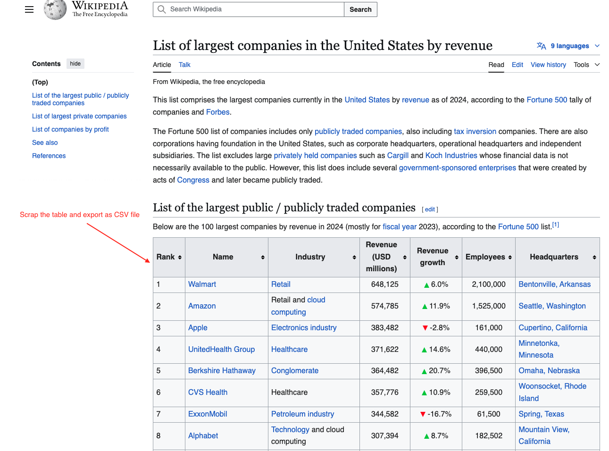
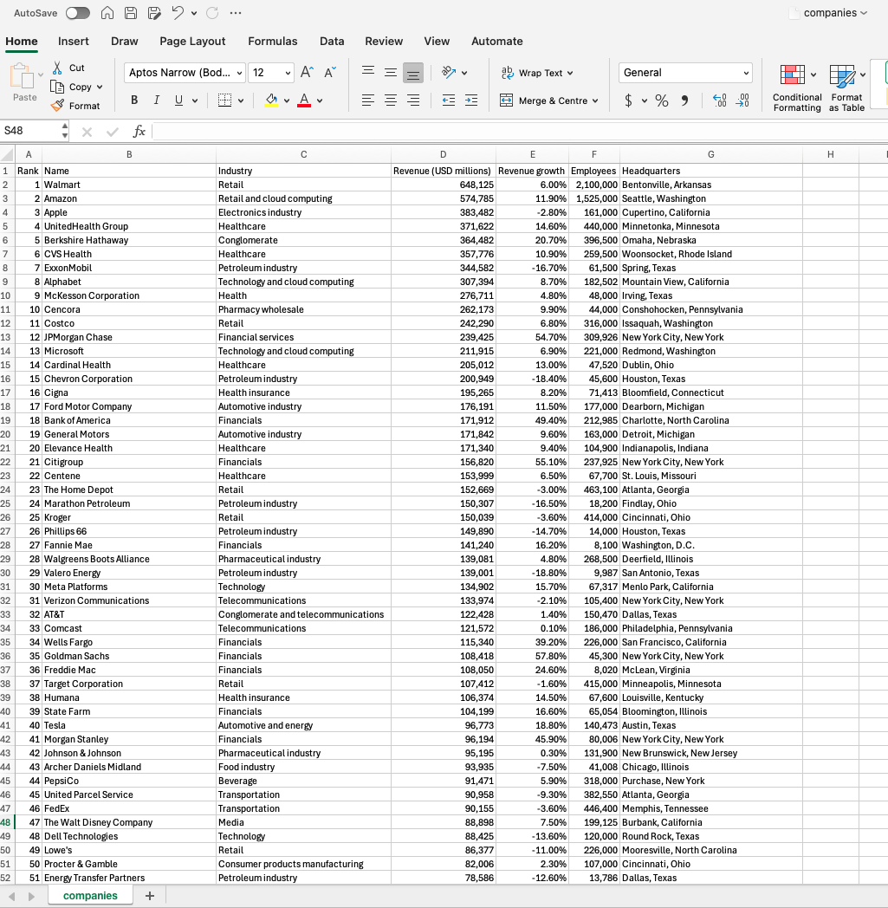

# Web Scraping Project

## Overview
This project extracts data from websites using **BeautifulSoup** and **Pandas**, then exports the data to a CSV file for further analysis.

## Workflow
- **Fetch Webpage**: Retrieve the webpage content.
- **Extract Data**: Scrape the necessary information.
- **Export to CSV**: Save the data in a structured format.

---

## 📌 Before: Data in Web Page
The raw data is available on the website in table format.

---

## 🚀 After: Scraped Data Exported to CSV
The extracted data is structured and saved as a CSV file.

---

